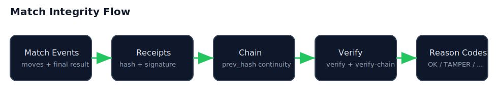
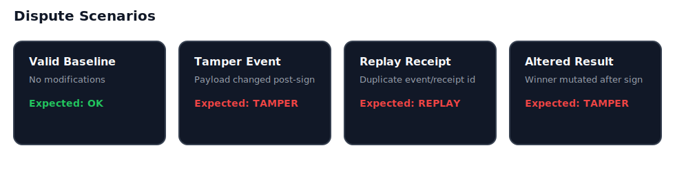
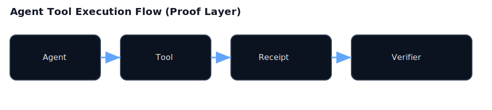

# ReceiptOS PQ Lab – Verifiable Match Integrity Demo

`receiptos-pq-lab` is a runnable demo bundle for proving match integrity.
It shows how signed receipts + chain verification catch tamper, replay, and altered outcomes with deterministic reason codes.
# Crypto-Agility Thesis

Quantum risk is not only a future key-recovery problem. It is also a migration problem.

A system that depends on one signature scheme can become fragile even if that scheme is considered strong today. Post-quantum signatures reduce one class of risk, but they do not eliminate implementation risk, cryptanalytic risk, or future algorithmic surprises.

ReceiptOS PQ Lab treats signatures as versioned verification lanes, not permanent assumptions.

## Principles

1. No single signature scheme should be treated as eternal.
2. Receipts should preserve enough metadata to verify what was signed, by whom, under which algorithm, and under which lane version.
3. Systems should support hybrid lanes during migration periods.
4. Verification should be policy-driven, so old lanes can be deprecated and new lanes can be introduced.
5. Agent/tool execution needs signed receipts because logs alone are not proofs.

## Example lanes

- classic_ed25519_v1
- hybrid_ed25519_mldsa_v1
- pq_mldsa_v1
- pq_hash_based_v1
- threshold_2_of_3_v1

## ReceiptOS position

ReceiptOS does not claim that any single post-quantum signature is permanently safe.

ReceiptOS provides a verifiable execution layer where cryptographic assumptions can be upgraded, combined, and audited over time.


## Quick Start

```bash
cd /mnt/d/receiptos-pq-lab
python3 demo/run_demo.py
```

Optional simulation extension:
```bash
python3 demo/run_demo.py --with-mirofish
```

---

## Main Schemes

### 1) Match Integrity Flow


### 2) Dispute Scenarios


---

## What this demo shows

- **Tamper detection** (`TAMPER`)
- **Replay detection** (`REPLAY`)
- **Bad signature detection** (`BAD_SIGNATURE`)
- **Chain integrity checks** (`CHAIN_MISMATCH`)
- **Valid baseline pass** (`OK`)

---

## Who is this for

### 🎮 Game Developers
- Problem: players dispute match outcomes.
- Need: prove if event history was modified.
- Demo value: one command -> reason-coded verdict per dispute case.

### 🤖 AI / Agent Developers
- Problem: logs are not proof.
- Need: verifiable execution artifacts.
- Demo value: receipt + chain verification gives deterministic integrity checks.

### 🔐 Security / Crypto Engineers
- Problem: audit trails without deterministic failure semantics.
- Need: clear machine-readable reason codes.
- Demo value: canonical outcomes (`OK`, `TAMPER`, `REPLAY`, etc.) for automation.

### 🎰 Provably Fair / RNG Systems
- Problem: trust claims without verifiable continuity.
- Need: replay/tamper-resistant event lineage.
- Demo value: receipt-chain continuity and mutation detection in realistic dispute flow.

---

## Match Integrity Flow


## Dispute Scenarios


## Agent Tool Execution Flow (optional context)



---

## Output

After `python3 demo/run_demo.py`:

- `artifacts/demo_run/match.json`
- `artifacts/demo_run/receipts.json`
- `artifacts/demo_run/receipts_chain.json`
- `artifacts/demo_run/disputes.json`
- `artifacts/demo_run/verification_output.json`
- `reports/verification_report.md`

---

## Optional MiroFish simulation

`--with-mirofish` adds extra dispute scenarios from `demo/mirofish_scenarios.py`.

Important:
- It is **simulation-only**.
- It does **not** modify deterministic verification logic.
- If MiroFish scenarios fail/unavailable, demo falls back gracefully and still completes.

---

## Demo walkthrough

See: [`docs/DEMO_WALKTHROUGH.md`](docs/DEMO_WALKTHROUGH.md)
