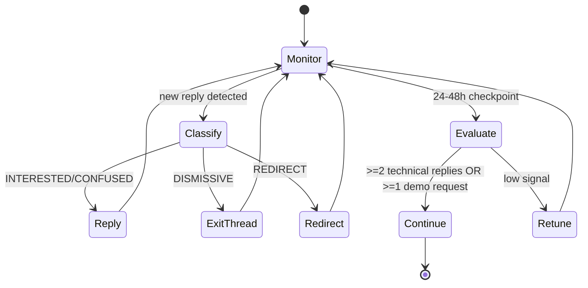

# ReceiptOS — End-to-End Process Visualization

> One-page visual map of how we operate now (product + outreach + monitor + response loop).

## 1) System Flow (high level)

```mermaid
flowchart TD
    A[Problem Signal\n"match result disputed"] --> B[Event Log Capture\nauthoritative server events]
    B --> C[Receipt Chain Build\n{event_id, prev_hash, payload, hash}]
    C --> D[Verifier\ncontinuity + tamper + replay checks]
    D --> E{Verdict}
    E -->|PASS| F[Integrity Confirmed\n"execution not manipulated"]
    E -->|FAIL| G[Integrity Broken\nreason: tamper/replay/continuity]

    F --> H[Support / Audit Decision]
    G --> H

    H --> I[Demo Artifacts\nvalid/tampered/replay fixtures]
    I --> J[Outreach Message\nmultiplayer authoritative segment]
    J --> K[Threads / Communities]
    K --> L[Monitor Responses\nclassify signals]
    L --> M{Signal Type}
    M -->|INTERESTED| N[Share demo + integration note]
    M -->|CONFUSED| O[Give concrete example]
    M -->|DISMISSIVE| P[Acknowledge and stop]
    M -->|REDIRECT| Q[Move to better-fit thread]
    N --> R[PMF Signal Log]
    O --> R
    P --> R
    Q --> R
```

---

## 2) Verification Logic (core)

```mermaid
flowchart LR
    A[event_i] --> B[Check prev_hash == hash_(i-1)]
    B --> C[Recompute hash_i = H(event_id + prev_hash + payload)]
    C --> D{Matches stored hash?}
    D -->|No| E[FAIL: tamper detected]
    D -->|Yes| F{duplicate/out-of-order event_id?}
    F -->|Yes| G[FAIL: replay/broken order]
    F -->|No| H[Continue]
```

---

## 3) Operating Loop (24–48h cadence)



---

## 4) Current Focus Boundary

- ✅ **In scope:** real-time multiplayer, authoritative backend, ordered event integrity
- ❌ **Out of scope:** casino/provably-fair RNG-only positioning

---

## 5) One-liner (current)

**We detect manipulation in execution history in systems where results can't be recomputed.**
