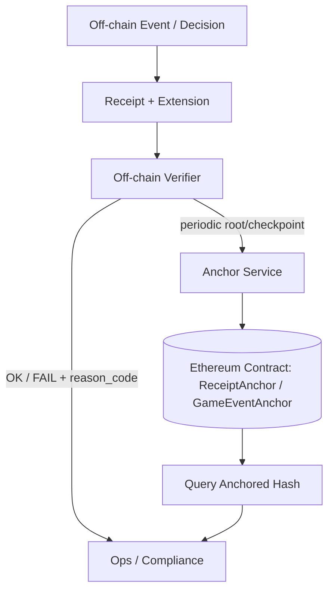

# Off-chain Verify + Optional On-chain Anchoring

```mermaid
flowchart TD
  E[Off-chain Event / Decision] --> R[Receipt + Extension]
  R --> V[Off-chain Verifier]
  V -->|OK / FAIL + reason_code| O[Ops / Compliance]
  V -->|periodic root/checkpoint| A[Anchor Service]
  A --> C[(Ethereum Contract: ReceiptAnchor / GameEventAnchor)]

  C --> Q[Query Anchored Hash]
  Q --> O
```

## Demo takeaway
- Verification remains off-chain first.
- On-chain layer is minimal anchoring/integrity harness.
