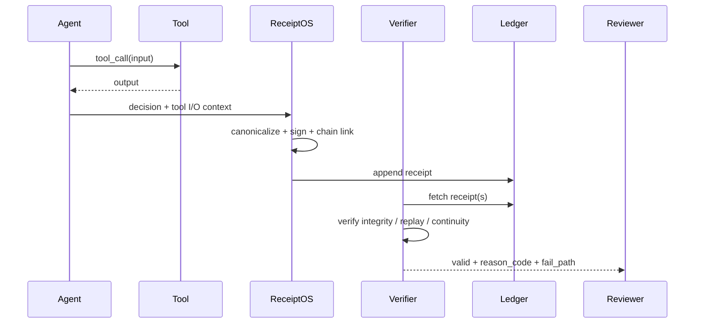

# Audit Trail Flow (Execution Provenance)

```mermaid
sequenceDiagram
  participant Agent
  participant Tool
  participant ReceiptOS
  participant Verifier
  participant Ledger
  participant Reviewer

  Agent->>Tool: tool_call(input)
  Tool-->>Agent: output
  Agent->>ReceiptOS: decision + tool I/O context
  ReceiptOS->>ReceiptOS: canonicalize + sign + chain link
  ReceiptOS->>Ledger: append receipt
  Verifier->>Ledger: fetch receipt(s)
  Verifier->>Verifier: verify integrity / replay / continuity
  Verifier-->>Reviewer: valid + reason_code + fail_path
```

## Demo takeaway
- Not just logs: machine-verifiable execution provenance.
- Review path is deterministic and automation-friendly.
