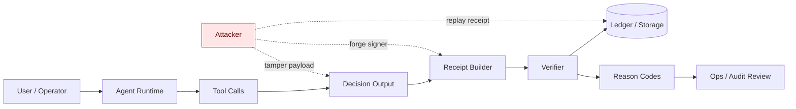

# Threat Model (Demo View)

```mermaid
flowchart LR
  U[User / Operator] --> A[Agent Runtime]
  A --> T[Tool Calls]
  T --> D[Decision Output]
  D --> R[Receipt Builder]
  R --> V[Verifier]
  V --> L[(Ledger / Storage)]

  X[Attacker] -. tamper payload .-> D
  X -. replay receipt .-> L
  X -. forge signer .-> R

  V --> RC[Reason Codes]
  RC --> O[Ops / Audit Review]

  classDef risk fill:#ffe5e5,stroke:#cc0000,color:#660000;
  class X risk;
```

## Demo takeaway
- Threats are explicit: tamper, replay, forged signer.
- Verification surfaces deterministic reason codes for audit/ops.
